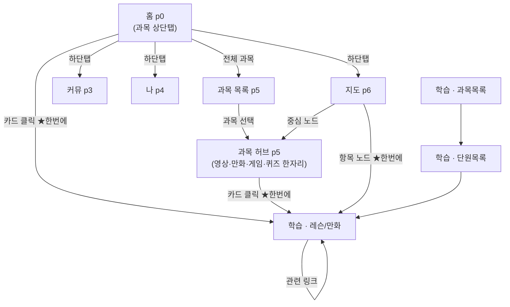

# 배움퀘스트 내비게이션 경로 지도 (2026-08-22 확정)

## 원칙 (딱 두 개)

1. **클릭은 목적지가 한 번에** — 중간 목록을 비추지 않는다.
2. **뒤로가기는 실제로 지나온 화면을 되감는다** — 안 가본 화면으로 보내지 않는다.

구현 = `nav_route.js`. 화면이 바뀌기 직전 상태(패널·학습단계·과목·홈탭·스크롤)를
스택에 쌓고, 뒤로가기(안드로이드·화면의 ← 모두)는 스택에서 꺼내 복원한다.

## 화면 지도

★ = 복합 이동. `go(1)→openSubject→openLesson`이 동기 한 덩어리로 실행되고
스택에는 **출발지 하나만** 쌓인다. (수정 전: 60ms 지연 동안 단원목록이 비쳤고,
뒤로가기가 그 단원목록으로 보내는 원인이었다.)

## 뒤로가기 규칙

| 지금 화면 | 뒤로가기 |
|---|---|
| 오버레이(게임·모달·전투·튜토리얼·영상퀴즈) | 그 오버레이만 닫힘 |
| 그 외 모든 화면 | **직전에 보던 화면** (스크롤 위치까지 복원) |
| 홈 + 지나온 길 없음 | "한 번 더 누르면 종료" |

## 실측 결과 (Playwright, 9경로)

| # | 경로 | 수정 전 뒤로가기 | 수정 후 |
|---|---|---|---|
| R1 | 홈→만화 클릭 | ❌ 단원목록(안 가본 화면) | ✅ 홈(보던 탭) |
| R2 | 과목허브→만화 | ❌ 단원→과목→홈 | ✅ 허브→과목목록→홈 |
| R3 | 레슨의 ← 버튼 | ❌ "← 단원" 목록행 | ✅ 온 곳으로 |
| R4 | 지도→back | ✅ | ✅ |
| R5 | 홈→과목→허브→back | ❌ 홈 직행(목록 건너뜀) | ✅ 목록→홈 |
| R6 | 학습탭 정식동선 | ✅ | ✅ (지나온 순서 그대로) |
| R7 | 레슨→관련만화→back | (신규) | ✅ 원래 레슨으로 |
| R8 | 지도→허브→back | (신규) | ✅ 지도로 |
| R9 | 홈에서 back | ✅ 종료 안내 | ✅ 유지 |

## 개발 규칙 (이후 화면 추가 시)

- 새 화면 이동은 반드시 `go()`/`openSubject()`/`openLesson()`/`lpOpenSubject()`를
  경유할 것 — 그래야 스택이 자동으로 쌓인다.
- 카드 하나로 여러 단계를 이동하는 새 함수를 만들면 `nav_route.js`의
  `wrapCompound()`로 감쌀 것.
- `cur`·`curSubj`는 `let` 선언이라 다른 파일에서 `window.cur`로 **읽을 수 없다**.
  패널 판정은 `document.querySelector('.pg.on')`로 할 것.
